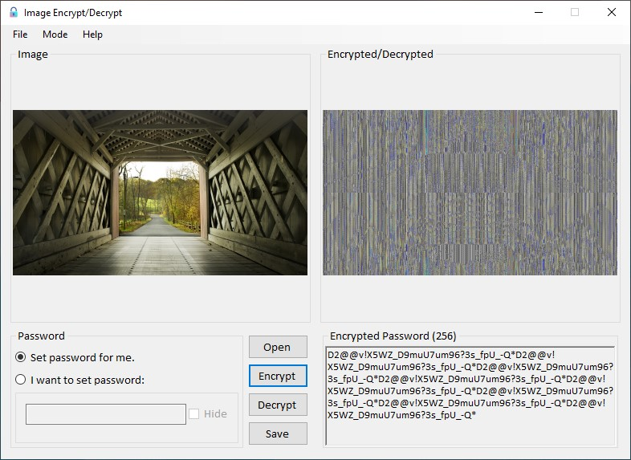

# Image Encryption/Decryption Project with C#

💻 _The encryption algorithm was developed by me_

⭐ _Educational purposes only_

## About the Project

- [x] Encrypts and decrypts images with custom algorithm

- [x] Images can encrypt with default or user defined key

- [x] Images can be RGB, grayscale etc.

## Modes
There are 2 modes available **easy/fast** mode (default) and **hard/slow** mode

:white_check_mark: **Easy/fast** mode uses `lockBits` and `unlockBits`

:white_check_mark: - **Hard/slow** mode uses `getPixel` and `setPixel`

👉 _Choose **hard/slow** mode for more complex encryption algorithm_
